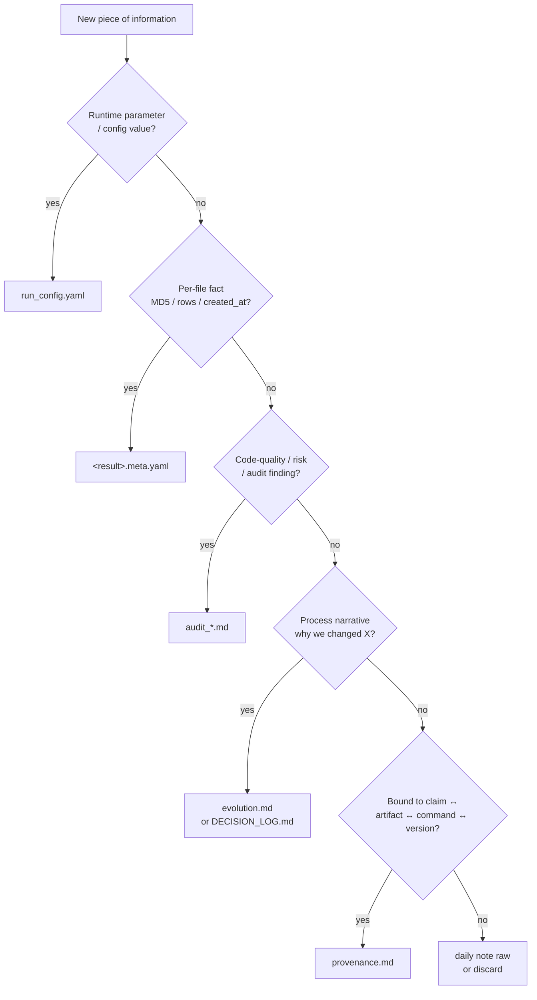

# Boundary Decision Flowchart

For each piece of information generated during analysis, decide which document it belongs to. This file is the canonical answer to spec §8 boundary statement.

## Quick decision tree



ASCII fallback for terminals without mermaid rendering:

```
                  ┌─ Is it a runtime parameter / config value? ───────→ run_config.yaml
                  │
                  ├─ Is it a per-file fact (MD5, rows, generation time)? ──→ <result>.meta.yaml
                  │
                  ├─ Is it code-quality / risk / audit finding? ─────→ audit_*.md
                  │
                  ├─ Is it a process narrative (why we changed X)? ──→ evolution.md / DECISION_LOG.md
                  │
                  ├─ Is it bound to claim ↔ artifact ↔ command ↔ version? ─→ provenance.md
                  │
                  └─ None of the above? ─────────────────────────────→ daily note (raw) / discard
```

## Detailed decision rules

### Rule 1: New parameter value introduced
- Source of truth → `run_config.yaml`
- If value is interpretation-critical (changes a claim) → also list in `provenance.md §6` (1-line summary + link)
- Why we picked this value → `DECISION_LOG.md`

### Rule 2: Discovered a caveat affecting claim validity
- Detailed risk write-up → `audit_*.md`
- 1-line summary + link in `provenance.md §0 caveats`

### Rule 3: A number was wrong; corrected in next version
- Process narrative → `evolution.md` (what changed, why, what triggered the realisation)
- Concrete (old, new, delta) → `provenance.md §8 封版差异对比表`
- Version timeline 1 line → `provenance.md §7`

### Rule 4: An artifact's MD5/rows changes
- Update `<result>.meta.yaml` (machine-written by pipeline)
- `provenance.md §4` reads from `.meta.yaml`; do NOT manually re-type values

### Rule 5: Multiple `run_config.yaml` files contributed to one sealed version
- List them in `archive/legacy_results/v{N}/runs_manifest.yaml`
- `provenance.md §1` references the manifest, does NOT duplicate per-run params

## Anti-patterns

| ❌ Wrong | ✅ Right |
|---------|---------|
| Copy 80% of `run_config.yaml` into provenance §6 | Cite the file path +摘录 ≤30% interpretation-critical fields |
| Copy `<result>.meta.yaml` MD5/rows into provenance §4 by hand | Run `aggregate_meta.py`; provenance §4 is auto-generated |
| Write process narrative in provenance §8 | Write in `evolution.md`; provenance §7 only writes 1-line version timeline; provenance §8 writes 封版差异 |
| Write detailed audit findings in provenance §0 caveats | Write in `audit_*.md`; provenance §0 only flags + links |

## Quantitative threshold

`lint_no_duplication.py` enforces ≤40% field overlap between any two adjacent docs in this hierarchy. See spec §8.1.
